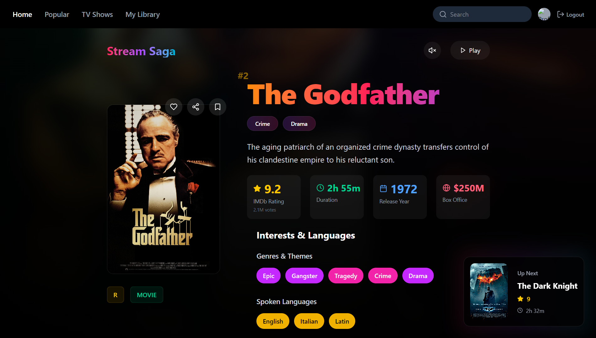

# Stream-Saga 🎬

An IMDb-style modern movie listing application built using React and TypeScript. It showcases popular movies using a dynamic, responsive interface with stylish UI and smooth user interactions. This is **not** a streaming platform — just a visual movie catalog.


## 🚀 Features

- 🎞️ Browse popular movies from IMDb API
- 🧾 Detailed movie modals with ratings, genre, runtime, budget, language & more
- 🌐 Responsive grid layout optimized for all devices
- 🎨 Modern and elegant UI with smooth hover and click animations
- 🔍 Clean modular code with custom hooks and reusable components



## 🛠️ Tech Stack

- **React + TypeScript**
- **Tailwind CSS** for UI styling
- **Lucide Icons** for visuals
- **RapidAPI** (IMDb endpoint) for fetching movie data

## 🧪 Getting Started

### 1. Clone the repository
```bash
git clone https://github.com/your-username/stream-saga.git
cd stream-saga
```

### 2. Install dependencies
```bash
pnpm install
```

### 3. Setup Environment Variables
Create a `.env` file in the root and add your [RapidAPI](https://rapidapi.com) key:
```bash
VITE_RAPIDAPI_KEY=your_rapidapi_key_here
```

### 4. Run the app
```bash
pnpm run dev
```

Open your browser at `http://localhost:5173`

---

Enjoy exploring movies on **Stream-Saga** 🍿

